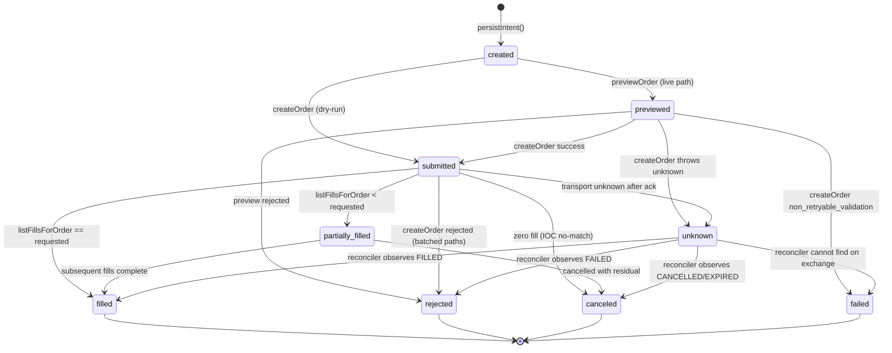

# Order lifecycle — state diagram (Phase 0)

Every economic order flows through the same state machine — entries and exits,
dry-run and live. The database is the ledger; Coinbase is consulted but never
assumed. See `apps/server/src/trading/executor.ts`.

## States

| State                | Meaning                                                                 |
| -------------------- | ----------------------------------------------------------------------- |
| `created`            | Intent persisted; not yet contacted with the exchange.                  |
| `previewed`          | Exchange previewed the order (size/status validated).                   |
| `submitted`          | Order submitted; exchange has acknowledged receipt.                     |
| `acknowledged`       | Reconciler observed an OPEN exchange order for this intent.             |
| `partially_filled`   | At least one fill recorded but not the full requested size.             |
| `filled`             | Terminal. All fills reconciled.                                         |
| `rejected`           | Terminal. Exchange explicitly rejected the order.                       |
| `canceled`           | Terminal. Order canceled / expired / zero fill.                         |
| `failed`             | Terminal. Never made it to the exchange (validation, precondition).     |
| `unknown`            | Non-terminal. Ambiguous outcome — reconciler must resolve.              |

## Transitions

## Guarantees the state machine provides

1. **Durable identity.** `clientOrderId` (derived deterministically from
   `purpose · token · mode · positionId · seed`) is written BEFORE the HTTP
   call. A crash during `createOrder` leaves the intent recoverable by
   `findOrderByClientId`.

2. **Idempotency.** `order_intents.clientOrderId` is `UNIQUE`. Two attempts
   with the same seed collide at the DB layer — the second attempt sees the
   existing intent and does not economically duplicate the first.

3. **No unknown retry.** A CoinbaseError with `class='unknown'` (timeout,
   5xx after ack) advances state to `unknown`. The reconciler, not the
   executor, resolves it — never a new `clientOrderId`.

4. **Positions from fills.** `positions` rows are created ONLY after
   `reconcileFillsForIntent` returns `filledSize > 0`. `avgEntryPrice`,
   `filledQuantity`, and `entryFees` come from the weighted aggregate of the
   actual fill rows — never from the scanner ticker.

5. **One completed trade per position.** The exit half of the round trip
   inserts a `round_trips` row; `getRoundTripSummary()` counts THAT table,
   never the legacy `trades` table (which was double-counting entry+exit).

6. **Optimistic locking.** `positions.version` is checked+incremented on
   every state transition. Two concurrent exit attempts on the same position
   fail cleanly instead of double-selling.

7. **Startup reconciliation gate.** `bot_config.reconciliationStatus` must
   be `'ok'` before `scanForEntries` will run. The reconciler compares
   non-terminal intents to Coinbase and DB positions to Coinbase holdings.

8. **Pause/CB semantics.** `manageOpenRisk` runs unconditionally each cycle.
   Only `scanForEntries` is gated by `isRunning`/`isPaused`/`circuitBreakerUntil`
   /`marketWindow`. The gate reads config AFTER exits, so a CB triggered in
   this same cycle blocks entries in this same cycle.
